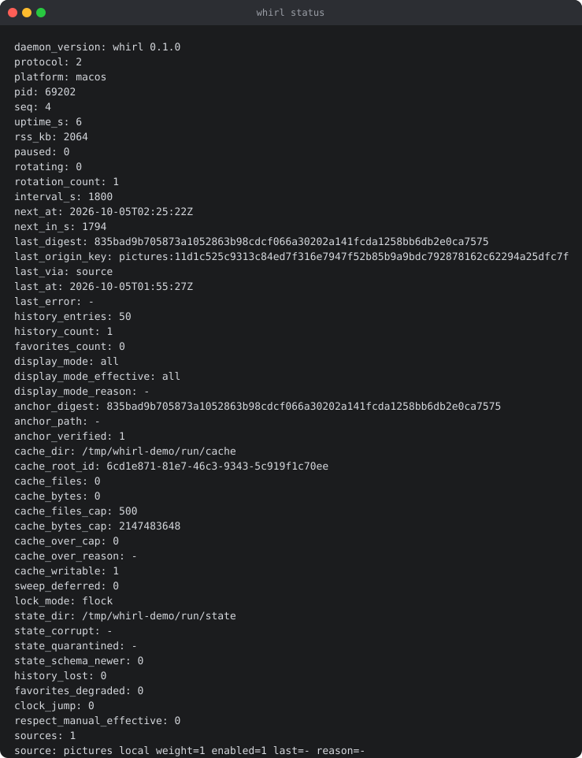

# whirl

Your wallpaper changes on a schedule, from the sources you choose, and the thing
doing it stays small.

[](https://github.com/guruor/whirl/actions/workflows/ci.yml)
[](https://github.com/guruor/whirl/releases)
[](LICENSE)




```text
daemon_version: whirl 0.2.1
protocol: 2
platform: macos
pid: 69202
seq: 4
uptime_s: 6
rss_kb: 2064
paused: 0
rotating: 0
rotation_count: 1
interval_s: 1800
next_at: 2026-10-05T02:25:22Z
next_in_s: 1794
last_digest: 835bad9b705873a1052863b98cdcf066a30202a141fcda1258bb6db2e0ca7575
last_origin_key: pictures:11d1c525c9313c84ed7f316e7947f52b85b9a9bdc792878162c62294a25dfc7f
last_via: source
last_at: 2026-10-05T01:55:27Z
last_error: -
history_entries: 50
history_count: 1
favorites_count: 0
display_mode: all
display_mode_effective: all
display_mode_reason: -
anchor_digest: 835bad9b705873a1052863b98cdcf066a30202a141fcda1258bb6db2e0ca7575
anchor_path: -
anchor_verified: 1
cache_dir: /tmp/whirl-demo/run/cache
cache_root_id: 6cd1e871-81e7-46c3-9343-5c919f1c70ee
cache_files: 0
cache_bytes: 0
cache_files_cap: 500
cache_bytes_cap: 2147483648
cache_over_cap: 0
cache_over_reason: -
cache_writable: 1
sweep_deferred: 0
lock_mode: flock
state_dir: /tmp/whirl-demo/run/state
state_corrupt: -
state_quarantined: -
state_schema_newer: 0
history_lost: 0
favorites_degraded: 0
clock_jump: 0
respect_manual_effective: 0
sources: 1
source: pictures local weight=1 enabled=1 last=- reason=-
```

## What it is

whirl manages a machine's desktop wallpaper: it picks an image from the sources
you configure, materialises it, and hands it to the platform. The decision the
design turns on is that **the resident process owns state and never owns pixels**.
`whirld` holds the config, the schedule, the history and the candidate list, and
spawns one short-lived `whirl-worker` for each operation that touches image bytes.
A frontend is optional: `whirl` is one client of the socket protocol, and the tray
app, a TUI or a shell script that speaks it is another.

That split is the measured argument for the design. On a machine where a
comparable wallpaper app settled at 883 MB resident, the same daemon with the
image work delegated stays flat at 1.8-2.3 MB across seven rotations, while the
in-process version ratchets to 140 MB and never returns
([prototype/README.md](prototype/README.md), the table and how it was measured).

## Quick start

macOS on Apple silicon. One command installs the daemon and the tray app; the
installer downloads both release archives, checks each against the sha256
published beside it, and installs only after both checks pass:

```sh
curl -fsSL https://raw.githubusercontent.com/guruor/whirl-ui/v0.2.1/install.sh | sh
```

The daemon reads one JSON config and needs a `sources` entry naming a folder of
your pictures; it writes an annotated default config the first time it starts.
Then, with `whirld` running:

```sh
whirl status     # everything the daemon knows, as key: value lines
whirl next       # pick an image now and set it
```

[docs/quickstart.md](docs/quickstart.md) is the one-page walk-through, including
building the three binaries from source instead.

## What it does

- **Sources are config entries, not plugins.** `local` walks a folder of your own
  pictures and sets the file itself; `wallhaven` searches the site's API or one
  collection. `whirl sources` lists what loaded, with its weight and last outcome.
- **A schedule you configure, and a pause.** `schedule.interval_seconds` (1800 by
  default) with `startup.*` for what to do at start; `whirl pause` and `whirl
  resume` re-arm it without touching the current picture. The daemon's own timer is
  the schedule, and `whirl daemon install` (macOS) puts it in front of the
  supervisor so it comes back after a reboot; the config is re-read on each
  rotation, so an edit needs no restart.
- **A rotation is a pipeline, and it is bounded.** A candidate goes through
  resolution, aspect ratio, size and content-type filters, two dedupe passes and
  the cache under a content digest; history is a ring of the last 50 rotations and
  favorites are pinned against eviction.
- **The control surface is a unix socket, mode 0600, in a directory the daemon
  creates 0700.** `whirl status` prints the daemon's whole state; `subscribe`
  streams one line per state change and `whirl idle` follows them. The protocol is
  the API, so anything that speaks it is a valid client and no frontend owns state.
- **macOS sets the picture; the other two platforms are not done.** The worker
  calls `NSWorkspace setDesktopImageURL:forScreen:options:error:` once per screen.
  The Linux and Windows setters ship as stubs that refuse with a named error and
  are labelled unverified on real hardware, so there the pipeline, the cache, the
  state and the CLI run and `WHIRL_BACKEND=noop` exercises everything but the
  setter.
- **A config file only.** One JSON file, no settings window, no tray required to
  operate. The config, socket, state and cache paths, and the backend, are
  environment variables too, which is what makes a rotation testable without
  touching a real desktop.

## The design rule

> The resident process owns state. It never owns pixels.

The measurements below are from the throwaway spike under
[`prototype/`](prototype/README.md), not from the released binaries:

| piece | resident | binary |
|---|---|---|
| daemon (Rust, no dependencies) | **1.8 MB at start, 2.3 MB after 7 rotations** | 0.69 MB |
| worker, one per rotation | 21-25 MB for ~1.5 s, then gone | 8.4 MB |
| CLI client | 0 MB (exits immediately) | 0.45 MB |
| same daemon doing the decode in-process, for comparison | **12 MB -> 140 MB, never returns** | — |

That last row is the whole argument: the identical workload, delegated instead of
owned, is flat forever.

## Non-goals

- A wallpaper browser or gallery.
- A GUI toolkit inside the daemon.
- Platforms or sources nobody asked for.

## Docs

[docs/architecture.md](docs/architecture.md) is the process model, the protocol and
the frontend contract; [docs/milestones.md](docs/milestones.md) records what shipped
and what is left. [docs/releases/v0.2.1.md](docs/releases/v0.2.1.md) is the release
note, including what is unverified and why.

## Contributing

[CONTRIBUTING.md](CONTRIBUTING.md) is the short version; [docs/development.md](docs/development.md)
is the long one: repo layout, toolchain and dependency policy, the test matrix, the
release process. The gate is `./scripts/ci.sh all`.

## Licence

MIT. See [LICENSE](LICENSE).
